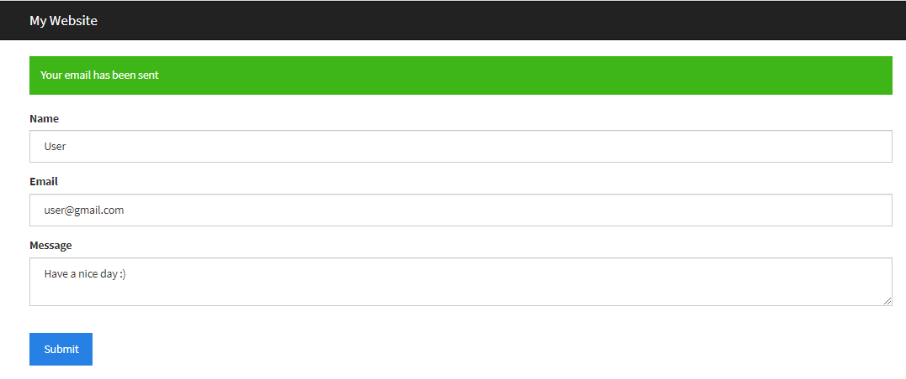

# CONTACT FORM PHP
___

This is a **simple PHP Contact Form** created from scratch. In order to send emails you need to have Your *mailserver* set up. Works good for me.  

Link to solve mailserver problem:
[SMTP Server](https://www.youtube.com/watch?v=mG4nPsepI9o)

